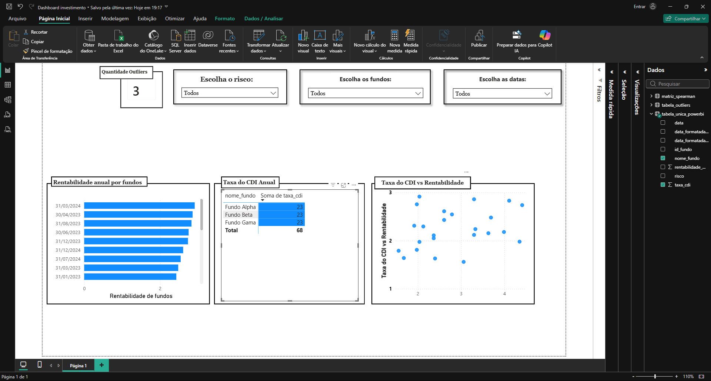

# 📊 Análise de Performance e Correlação de Fundos de Investimento

Este projeto foi desenvolvido como parte do Projeto **Investimento**, com o objetivo de construir uma solução de inteligência de negócios de ponta a ponta. A pipeline engloba desde a **extração** e **limpeza** pesada de dados financeiros utilizando **Python (Pandas)** até a **modelagem**, **tratamento estatístico de anomalias (outliers)**, **cálculo de correlação** e criação de um **dashboard** interativo no **Power BI**.



## 🛠️ Tecnologias e Ferramentas Utilizadas

- **Linguagem Principal:** Python 3
- **Bibliotecas de Dados:** pandas, numpy
- **Estatística:** scipy.stats (função spearmanr)
- **Visualização e BI:** Power BI Desktop
- **Mecanismo de Análise:** Linguagem DAX (Data Analysis Expressions)

## 📁 Estrutura do Projeto

- **limpeza_dados.py:** Script Python responsável pela carga dos dados brutos, conversão de tipos, cálculo do IQR, substituição de outliers e geração da matriz de correlação.
- **tabela_unica_powerbi.csv:** Base de dados final consolidada após o processo de Merge.
- **matriz_spearman.csv:** Tabela contendo os coeficientes de correlação de Spearman calculados por fundo.
- **dashboard_fundos.pbix:** Arquivo do Power BI com o relatório interativo e visuais.

## ⚙️ Processo de Engenharia e Tratamento de Dados (Python)

A base de dados original continha distorções severas que poluíam as médias e os gráficos de dispersão (como meses com rentabilidades fictícias de $10.24\%$). O processo de higienização seguiu os seguintes passos:

- **Padronização:** Conversão de strings e tratamento de formatos de data.
- **Identificação de Outliers (IQR):** Para cada fundo individualmente, foi calculado o Intervalo Interquartil ($IQR = Q3 - Q1$). Os limites aceitáveis foram definidos como:

$$Limite\ Superior = Q3 + (1.5 \times IQR)$$
$$Limite\ Inferior = Q1 - (1.5 \times IQR)$$

- **Tratamento por Mediana:** As anomalias encontradas foram isoladas em uma tabela de controle (tabela_outliers.csv) e substituídas dinamicamente pela mediana do respectivo fundo, preservando a volumetria da base original (73 registros) sem distorcer o histórico real.
- **Cálculo Estatístico:** Execução do algoritmo de Correlação de Spearman para extrair a relação linear e não-linear entre as cotas dos fundos e a taxa CDI.

## 📈 Análise dos Resultados Estatísticos (Matriz de Spearman)

A matriz gerada e renderizada via formatação condicional no Power BI trouxe os seguintes coeficientes de correlação em relação ao CDI:

| Nome do Fundo | Correlação (Spearman) | Comportamento de Mercado |
| :--- | :--- | :--- |
| Fundo Alpha | 0.84 (Alta/Positiva) | Ativo pós-fixado tradicional (Fundo DI). Sua rentabilidade caminha de forma diretamente proporcional aos juros |
| Fundo Beta | -0.12 (Nula/Negativa) | Ativo descorrelacionado. Comportamento típico de fundos Multimercado ou de Ações, onde a estratégia do gestor dita o ganho, independentemente do CDI |
| Fundo Gama | 0.03 (Neutro) | Ativo totalmente independente. Excelente para diversificação, pois o risco da carteira não está associado à oscilação da taxa de juros brasileira. |

## 📊 O Dashboard (Power BI)

O relatório foi desenhado para responder às principais dores de um analista de investimentos, contendo:

- **Cartões Dinâmicos (DAX):** Exibição da quantidade exata de outliers removidos por fundo utilizando a medida:

```
Snippet de código

   Total_Outliers = COUNTROWS(tabela_outliers)

```
- **Gráfico de Dispersão:** Cruzamento de Rentabilidade vs. CDI exibindo a linha de tendência ajustada após a limpeza dos dados.

- **Matriz de Correlação Nativa:** Tabela matricial colorida em gradiente (Heatmap), permitindo uma leitura visual imediata do comportamento dos fundos.

## 🚀 Como Executar o Projeto

1. Certifique-se de ter o Python e as bibliotecas necessárias instaladas:

```
Bash

pip install pandas numpy scipy
```

2. Execute o script Python para processar as bases brutas e gerar os arquivos limpos:
```
Bash

python limpeza_dados.py
```

3. Abra o arquivo dashboard_fundos.pbix no Power BI Desktop e clique em Atualizar para carregar os novos dados processados.

### 📝 Autor

**Andrei - Analista de Dados / Desenvolvedor**